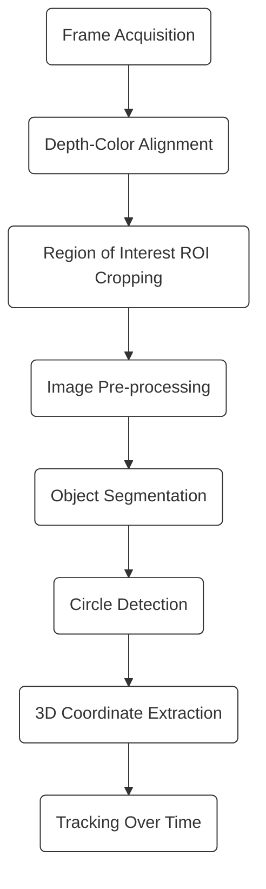

# Tracking Evaluation Method

This document explains how tracking performance is evaluated using
`Evaluation.matlab`.

---

## 1. Evaluation Objectives

The evaluation focuses on:
- Motion amplitude in 3D space
- Deviation from ideal and reference trajectories
- Tracking efficiency

---

## 2. Trajectory Smoothing

- Raw tracking data (X, Y, Z) is smoothed
- Purpose:
  - Reduce noise
  - Highlight motion trend

---

## 3. Amplitude Calculation

For each axis:
- Minimum and maximum values are extracted
- Amplitude is calculated as:

- Unit is converted from meters to millimeters

---

## 4. Reference Trajectories

Two reference models are used:

### 4.1 Ideal Trajectory
- Predefined ideal motion amplitude
- Represents expected system behavior

### 4.2 Model Trajectory
- Reference trajectory derived from system model

---

## 5. Error Metrics

Errors are computed as:

- Error w.r.t. Ideal:
- Error w.r.t. Model:

These errors indicate tracking deviation in each axis.

---

## 6. Tracking Efficiency

Tracking efficiency is defined as:

- Reflects robustness of object detection
- Penalizes missed detections

---

## 7. Visualization

- Raw and smoothed trajectories are plotted
- Enables qualitative assessment of tracking stability

---

## 8. Evaluation Summary

The evaluation combines:
- Quantitative accuracy
- Robustness of detection
- Temporal consistency of tracking
