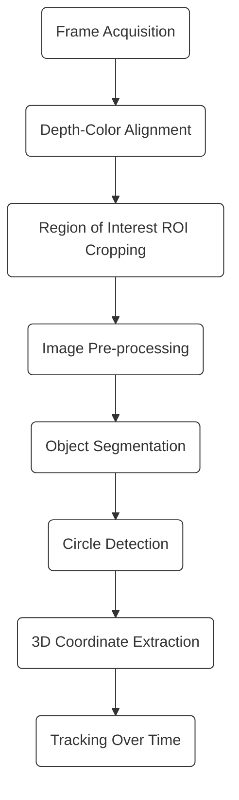

# Processing Pipeline – Object Tracking

This document describes the logical flow of the MATLAB script
`Tracking.matlab`, which performs real-time object detection and 3D tracking
using Intel RealSense RGB-D data.

---

## 1. High-Level Processing Flow

---

## 2. Frame Acquisition

- RGB and depth frames are streamed from the RealSense camera
- Initial frames are discarded to stabilize the camera output

---

## 3. Depth Alignment

- Depth frame is aligned to the RGB frame
- Ensures pixel-wise correspondence between color and depth data

---

## 4. Region of Interest (ROI)

- A fixed rectangular region is cropped from the RGB frame
- Purpose:
  - Reduce computation cost
  - Focus on the object of interest

---

## 5. Image Pre-processing

- RGB image is converted to grayscale (green channel)
- Thresholding is applied to generate a binary image

---

## 6. Post-processing (Morphology)

- Inversion of binary image
- Morphological operations:
  - Dilation to enhance object area
  - Erosion to remove noise

---

## 7. Object Detection

- Circular object detection using Hough Circle Transform
- Conditions:
  - Exactly one circle detected
  - Valid RGB and depth frames

---

## 8. 3D Coordinate Extraction

- Point cloud is generated from the depth frame
- Pixel coordinates of detected object center are mapped to 3D space
- Bilinear interpolation is used to improve coordinate precision

---

## 9. Tracking Logic

- 3D coordinates are accumulated over frames
- Time stamps are recorded for trajectory analysis
- If detection fails:
  - Frame is skipped
  - Tracking efficiency is updated

---

## 10. Output

- Real-time visualization with object marker
- Logged 3D coordinates (X, Y, Z) for evaluation
